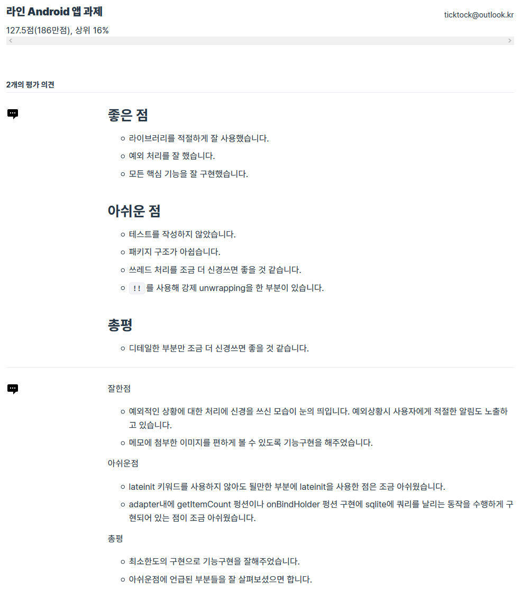

# LineTest

라인 Android 앱 과제

## 요구사항

```
환경 요구사항
Android
	• 언어: Java, Kotlin 중 택1
	• minSdkVersion: 21
	• targetSdkVersion: 27 이상
	• 라이브러리 사용: 필요시 외부 라이브러리 사용이 가능하며, 사용시 출처(링크)를 주석으로 포함해주세요. 단, AndroidX, Google 라이브러리는 출처를 적지 않아도 됩니다.
기능 요구사항
기능1: 메모리스트
	1. 로컬 영역에 저장된 메모를 읽어 리스트 형태로 화면에 표시합니다.
	2. 리스트에는 메모에 첨부되어있는 이미지의 썸네일, 제목, 글의 일부가 보여집니다. (이미지가 n개일 경우, 첫 번째 이미지가 썸네일이 되어야 함)
	3. 리스트의 메모를 선택하면 메모 상세 보기 화면으로 이동합니다.
	4. 새 메모 작성하기 기능을 통해 메모 작성 화면으로 이동할 수 있습니다.
기능2: 메모 상세 보기
	1. 작성된 메모의 제목과 본문을 볼 수 있습니다.
	2. 메모에 첨부되어있는 이미지를 볼 수 있습니다. (이미지는 n개 존재 가능)
	3. 메뉴를 통해 메모 내용 편집 또는 삭제가 가능합니다.
기능3: 메모 편집 및 작성
	1. 제목 입력란과 본문 입력란, 이미지 첨부란이 구분되어 있어야 합니다. (글 중간에 이미지가 들어갈 수 있는 것이 아닌, 첨부된 이미지가 노출되는 부분이 따로 존재)
	2. 이미지 첨부란의 ‘추가' 버튼을 통해 이미지 첨부가 가능합니다. 첨부할 이미지는 다음 중 한 가지 방법을 선택해서 추가할 수 있습니다. 이미지는 0개 이상 첨부할 수 있습니다. 외부 이미지의 경우, 이미지를 가져올 수 없는 경우(URL이 잘못되었거나)에 대한 처리도 필요합니다.
		○ 사진첩에 저장되어 있는 이미지
		○ 카메라로 새로 촬영한 이미지
		○ 외부 이미지 주소(URL)
	3. 편집 시에는 기존에 첨부된 이미지가 나타나며, 이미지를 더 추가하거나 기존 이미지를 삭제할 수 있습니다.
```

## 결과

